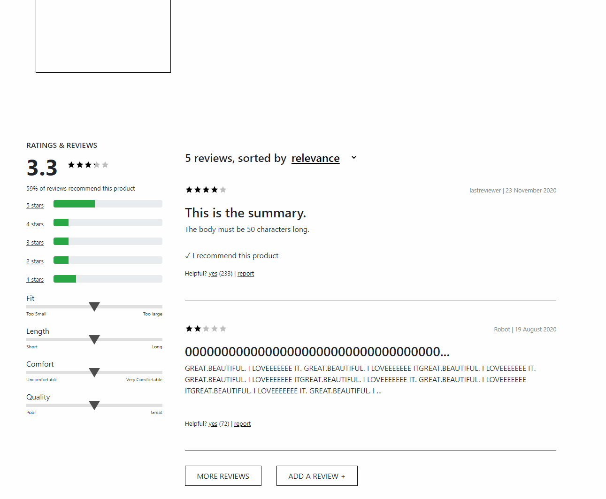

# Project Catwalk - Retail Web Portal

This project was build out by 3 developers over the course of two weeks. The app is built to the specifications of a 24 page business requirement document. The primary technologies used are React (with React Hooks and custom styled components), with Express to render data from a headless API, Material UI for certain components, and CSS for general styling and custom component design.


## Building and installing env

First install dependencies:

```sh
npm install
```

To run node server:

```sh
npm start
```

To create a production build:

```sh
npm run build-prod
```

To create a development build:

```sh
npm run build-dev
```

## Running

Open the file `dist/index.html` in your browser

## Tech Stack

- [React](https://reactjs.org/)
- [Node](https://nodejs.org/en/)
- [Express](https://expressjs.com/)
- [AWS](https://aws.amazon.com/)

## Components

### Product Overview

The top most section on each individual projects page. Designed to guide the user through making selections for style and size.


### Related Products

The related products portion of the page is divided into two main components. The first of which displays products related to the highlighted page on the product overview, and makes comparisons to the aforementioned product. The second part is the 'Outfits' creation portion, in which users can save articles as a collection.


### Ratings and Reviews

The ratings and reviews portion of the page consists of the ratings component to the left, and the review component to the right. The ratings part displayed information pertaining to the selected product, including user feedback for specific item characteristics and user ratings. The review part allows the user to sort reviews by a few different methods and also to filter reviews be rating. Additionally there is a form that allows the user to submit new reviews.


